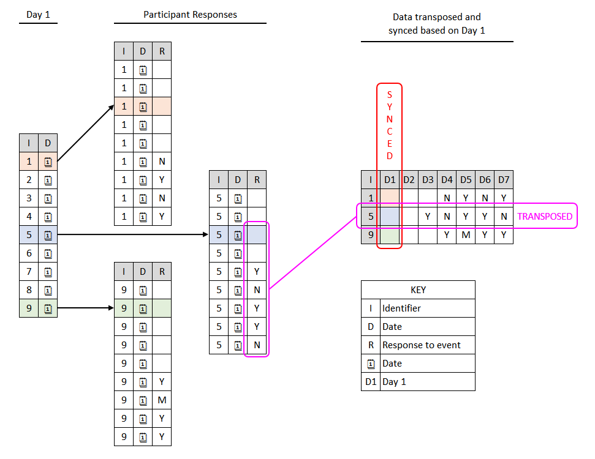

# CSV_CTS (Consolidate, Transpose, Syncronize CSVs)

## Description

The main script, `report.py` takes a directory tree of CSV files,
consolidates them, transposes the data into a date series, references a
known 'start date' for each file and synchronises the CSVs based on this
date. 

It outputs an output file with the results, and a log file with any
issues found while processing files.

## Requirements

* Python 3.6
* Pandas 0.19.2
* Numpy 1.11.3

## To run

To test the script from the root directory run:

    python report.py -c example\config.ini

## Input files

### Data files

The input files have at least an Id column (normally unique to the file),
a date column, and a response column (with values like Yes/No/Missing).

See the files in subdirectories of **CSV_CTS\example\data** for sample inputs.

### Reference file

The known 'start date' for each ID is specified in a separate CSV file,
with an additional offset specified in the `config.ini`.

See the file `CSV_CTS\example\date_day1.csv` for an example.

## Configuration

Many parameters can be specified in an associated configuration file.

This can specify the location of the input and output, and column names
and values.

By default this file is assumed to be named config.ini in the directory
this is executed in; but can be specified from the command line with -c.
See the file `CSV_CTS\example\config.ini` for a full example.

## Tools

With large amounts of data being manually collated there is potental for errors in the source files. A program has been provided that collates all the CSV files within a directory tree that matches the same file mask as the main routine and puts the data into a single file for review so errors and inconsistencies can be identified.

Normally the main program captures most errors and inserts them in the log, so usually this program is only needed if the main routine throws and error that can not be explained

To run the collation routine from the root directory type:

	python collate_csv.py -c example\config.ini

The output file can be reviewed in any package that recognises CSV files (e.g. Microsoft Excel, LibreOffice Calc).

## License

This library is released under [GPLv3 Licence](https://github.com/GFA-RDIP/CSV_CTS/blob/master/licenses/GPL_v3.txt "GPLv3 License").

## Files

* report.py - Main reporting script run with Python
* requirements.txt - Python dependencies. Install with `pip install -r requirements.txt`
* examples - Example data
* licences - GPLv3 Licence
